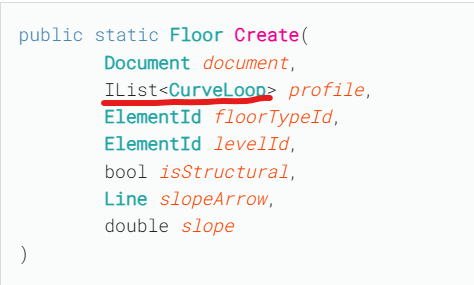

# REVIT và các yếu tố hình học

## Wall, Floors, Ceilings, Roofs and Openings

### WALL
<pre>
    # Import các thư viện cần thiết
    from Autodesk.Revit.DB import Transaction, Wall, ElementId
    from Autodesk.Revit.UI.Selection import Selection

    # Lấy đối tượng tài liệu hiện hành
    doc = __revit__.ActiveUIDocument.Document
    uidoc = __revit__.ActiveUIDocument

    # Bắt đầu một Transaction
    t = Transaction(doc, "Create Walls")
    t.Start()

    try:
        # Lấy các đối tượng được chọn (các đường mô hình)
        # Bạn cần chọn các đường mô hình trước khi chạy script
        selection = [doc.GetElement(elId) for elId in uidoc.Selection.GetElementIds()]

        # Thay thế Wall Type ID và Level ID bằng các giá trị bạn đã ghi lại từ Revit Lookup
        # Ví dụ:
        wall_type_id = ElementId(310057) # Thay thế bằng Type ID của tường của bạn
        level_id = ElementId(310046) # Thay thế bằng Level ID của tầng của bạn

        # Lặp qua từng đối tượng được chọn
        for s in selection:
            # Chuyển đổi ModelLine thành GeometryCurve
            # Revit API cần Curve để tạo tường
            ln = s.GeometryCurve

            # Tạo tường
            # Các tham số:
            # doc: tài liệu Revit hiện hành
            # ln: đường cong (GeometryCurve)
            # wall_type_id: ElementId của loại tường
            # level_id: ElementId của tầng
            # height: Chiều cao của tường (ví dụ: 10 feet)
            # offset: Độ lệch của tường so với đường cong
            # flip: Boolean để lật hướng tường (False hoặc True)
            # structural: Boolean cho tường kết cấu (False hoặc True)
            Wall.Create(doc, ln, wall_type_id, level_id, 10, 0, False, False)

        # Commit Transaction để lưu các thay đổi
        t.Commit()
        print("Walls created successfully!")

    except Exception as ex:
        # Nếu có lỗi, rollback Transaction
        t.RollBack()
        print(f"Error: {ex}")

</pre>

nhìn vào API trên nhận ra được. Để tạo 1 đối tượng Floor thì nó cần 1 danh sách các Curveloon. mổi Curveloon nó có thể là 1 đường thẳng (Line) hoặc đường công bất kì tạo vòng lặp khép kính.

# FLOOR

- 

<pre>
# -*- coding: utf-8 -*-
__title__ = "Create Floor"
__author__ = "Thanh Hoai"
__doc__ = """This is Hello World Button.
Click on it see what happens..."""

from System.Collections.Generic import List
from Autodesk.Revit import DB
from Autodesk.Revit import UI

uidoc = __revit__.ActiveUIDocument  # everything you see.
doc = __revit__.ActiveUIDocument.Document # everything revit has.

if __name__ == '__main__':
    
    with DB.Transaction(doc, 'Hello World') as t:
        t.Start()
        
        # tim level 
        level = DB.FilteredElementCollector(doc).OfClass(DB.Level).FirstElement() 

        # tim floor type
        floor_type = DB.FilteredElementCollector(doc)\
                        .OfCategory(DB.BuiltInCategory.OST_Floors)\
                        .WhereElementIsElementType()\
                        .FirstElement()

        if not level or not floor_type:
            UI.TaskDialog.Show('Error', 'No level or floor type found in this project.')
            t.RollBack()
        else:
            p1 = DB.XYZ(0, 0, 0)
            p2 = DB.XYZ(10 * 3.28084, 0, 0)        # 10m theo trục X
            p3 = DB.XYZ(10 * 3.28084, 5 * 3.28084, 0) # 5m theo trục Y
            p4 = DB.XYZ(0, 5 * 3.28084, 0)  

            # tao cac duong Line
            line1 = DB.Line.CreateBound(p1, p2)
            line2 = DB.Line.CreateBound(p2, p3)
            line3 = DB.Line.CreateBound(p3, p4)
            line4 = DB.Line.CreateBound(p4, p1)
            
            # tao cac duong cong khep kin
            curve_loop = DB.CurveLoop()
            curve_loop.Append(line1)
            curve_loop.Append(line2)
            curve_loop.Append(line3)
            curve_loop.Append(line4)

            list_of_curve_loops = List[DB.CurveLoop]([curve_loop])
            # tao san
            # Bước 6: Tạo sàn (SỬA LẠI DÒNG NÀY)
            new_floor = DB.Floor.Create(
                doc,                   # 1. Document
                list_of_curve_loops,   # 2. IList<CurveLoop>
                floor_type.Id,         # 3. ElementId của FloorType
                level.Id               # 4. ElementId của Level
            )
            
            UI.TaskDialog.Show("Thành công", "Đã tạo sàn mới thành công!")

        t.Commit()

</pre>

### Openning

- Đây là 1 đối tượng phụ thuộc vào 1 bức tường Yêu cầu phải cung cấp 1 đối tượng tường để chúng đính vào.

<pre>

    # -*- coding: utf-8 -*-
__title__ = "Create Door on Wall"

from Autodesk.Revit import DB
from Autodesk.Revit import UI
from Autodesk.Revit.DB import Structure
from Autodesk.Revit.UI import Selection

uidoc = __revit__.ActiveUIDocument
doc = uidoc.Document

# Tạo một bộ lọc để chỉ cho phép chọn tường
class WallSelectionFilter(Selection.ISelectionFilter):
    def AllowElement(self, element):
        # Chỉ trả về True nếu đối tượng là một bức tường
        if isinstance(element, DB.Wall):
            return True
        return False

    def AllowReference(self, reference, point):
        return False

try:
    with DB.Transaction(doc, "Create Door") as t:
        t.Start()

        # Bước 1: Yêu cầu người dùng chọn một bức tường
        wall_filter = WallSelectionFilter()
        wall_ref = uidoc.Selection.PickObject(Selection.ObjectType.Element, wall_filter, "Hãy chọn một bức tường để đặt cửa")
        host_wall = doc.GetElement(wall_ref)

        # Bước 2: Tìm một loại cửa (FamilySymbol) trong dự án
        # Dùng FilteredElementCollector với danh mục là OST_Doors
        door_symbol = DB.FilteredElementCollector(doc)\
                        .OfCategory(DB.BuiltInCategory.OST_Doors)\
                        .WhereElementIsElementType()\
                        .FirstElement()

        if not door_symbol:
            UI.TaskDialog.Show("Lỗi", "Không tìm thấy loại cửa (Door Type) nào trong dự án. Hãy load một family cửa vào trước.")
            t.RollBack()
        else:
            # Kích hoạt family symbol nếu cần
            if not door_symbol.IsActive:
                door_symbol.Activate()
                doc.Regenerate()

            # Bước 3: Lấy các thông tin cần thiết từ tường vật chủ
            # Lấy level của tường
            level = doc.GetElement(host_wall.LevelId)
            
            # Lấy đường location của tường và tìm điểm giữa
            location_curve = host_wall.Location.Curve
            mid_point = location_curve.Evaluate(0.5, True) # 0.5 = 50% (điểm giữa), True = normalized

            # Bước 4: Tạo cửa bằng NewFamilyInstance
            # Sử dụng một overload khác của hàm này, có tham số 'host'
            new_door = doc.Create.NewFamilyInstance(
                mid_point,      # Vị trí đặt cửa trên tường
                door_symbol,    # Loại cửa (FamilySymbol)
                host_wall,      # Tường vật chủ (Host Element)
                level,          # Level chứa cửa
                Structure.StructuralType.NonStructural # Cửa không phải là đối tượng kết cấu
            )

            t.Commit()
            UI.TaskDialog.Show("Thành công", "Đã tạo cửa mới thành công!")

except Exception as e:
    if "Operation cancelled" in str(e):
        print("Thao tác đã bị hủy.")
    else:
        print("Đã xảy ra lỗi: {}".format(e))
    # Đảm bảo transaction được rollback nếu có lỗi
    if t.HasStarted() and not t.HasEnded():
        t.RollBack()
</pre>

* API thật là tiện lời: Ví như 1 con robot. Chỉ cần đi tìm đủ chân, tay Và nó hoạt đông.

....
Em sẽ update và giải thích thêm sau này. 